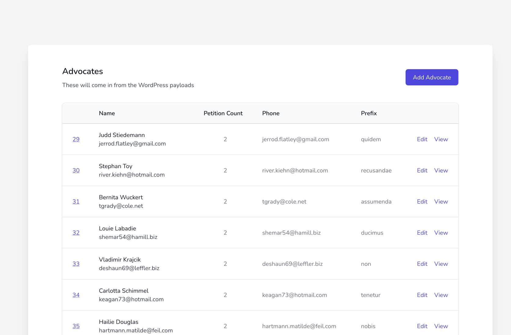
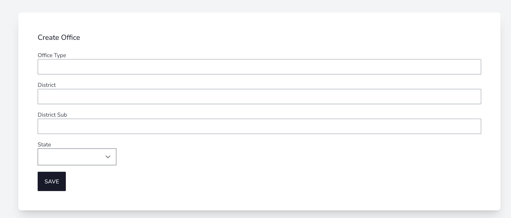
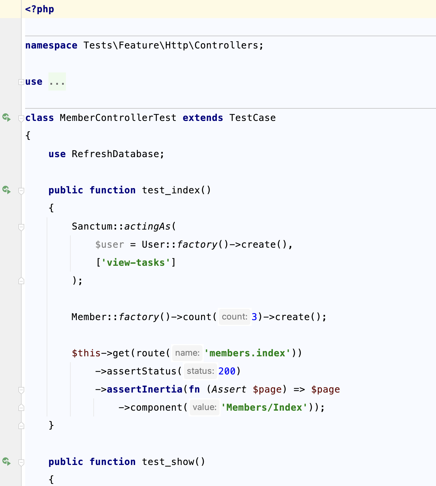

# Help with some basic CRUD and UI using Inertia, Tailwind

[](https://github.com/alnutile/inertia-crud/actions/workflows/run-tests.yml)
[](https://packagist.org/packages/alnutile/inertia-crud)


>Thanks to [https://github.com/spatie/package-skeleton-laravel](https://github.com/spatie/package-skeleton-laravel)

## TL;DR

I got sick of making the same thing over and over on projects, so I made a command to output my stub files, so I can with one command
have all the Inertia CRUD files needed. (DELETE is coming soon)

> Yes I know there are others out there, but I wanted one that fit my current workflow.


All you need to do is run the command: 

```bash 
php artisan inertia-crud:create Dog Dogs
```

And it will do the rest. 

>Yes I ask for the `Model` name capitalized and plural, so I do not have to code that logic.

Then you will have these files made:

```
app/Http/Controllers/DogController.php
tests/Features/Http/Controllers/DogControllerTest.php
resources/js/Pages/Dogs/Index.vue
resources/js/Pages/Dogs/Show.vue
resources/js/Pages/Dogs/Edit.vue
resources/js/Pages/Dogs/Create.vue
resources/js/Pages/Dogs/Components/ResourceForm.vue
```

And the routes will have:

```php 
Route::controller(\App\Http\Controllers\DogController::class)
    ->group(function () {
        Route::get('/dogs', 'index')->name('dogs.index');
        Route::get('/dogs/create', 'create')->name('dogs.create');
        Route::post('/dogs/create', 'store')->name('dogs.store');
        Route::get('/dogs/{dog}', 'show')->name('dogs.show');
        Route::get('/dogs/{dog}/edit', 'edit')->name('dogs.edit');
        Route::put('/dogs/{dog}', 'update')->name('dogs.update');
    });

```

## Overview

This will put some simple ready to go CRUD files into place, for Inertia. 

For example an Index page:



>PHP Faker generated data in example btw

I just need to do is line up the fields and columns in the `Index.vue` file.

Then when someone pressed **Add** I need that page as well.



You will see this has a select list. This shows a component I include, based on JetStream that
makes that easy as well.


The controller includes a test 🎉



All these routes will be made as well, also including testse:

```php 
Route::controller(\App\Http\Controllers\OfficeController::class)
    ->group(function () {
        Route::get('/offices', 'index')->name('offices.index');
        Route::get('/offices/create', 'create')->name('offices.create');
        Route::post('/offices/create', 'store')->name('offices.store');
        Route::get('/offices/{office}', 'show')->name('offices.show');
        Route::get('/offices/{office}/edit', 'edit')->name('offices.edit');
        Route::put('/offices/{office}', 'update')->name('offices.update');
    });
```


This package assumes this layout.

  * `app/Http/Controllers` for the controllers
  * `routes/web.php` for the routes
  * `resources/js/Components` for a few of those
  * `resources/js/Pages/` to put the resource related Vue crud

On that note it assumes:
  * Tailwind
  * VueJS 3
  * Inertia 
  * vue-toastification

Some components come from JetStream, like almost all!

You may have to fix the `import AppLayout from '@/Layouts/AppLayout.vue';` in the files 
I will make that a config option later.

## TODO 
  * Add DELETE
  * Add config file for more options/paths etc
  * Add config option for the `AppLayout.vue`


## Installation
You can install the package via composer:

```bash
composer require alnutile/inertia-crud --dev
```

## Usage

```bash 
php artisan inertia-crud:create Dog Dogs
```

## Testing

```bash
composer test
```

## Changelog

Please see [CHANGELOG](CHANGELOG.md) for more information on what has changed recently.

## Contributing

Please see [CONTRIBUTING](CONTRIBUTING.md) for details.

## Security Vulnerabilities

Please review [our security policy](../../security/policy) on how to report security vulnerabilities.

## Credits

- [Alfred Nutile](https://github.com/alnutile)
- [All Contributors](../../contributors)

## License

The MIT License (MIT). Please see [License File](LICENSE.md) for more information.**
